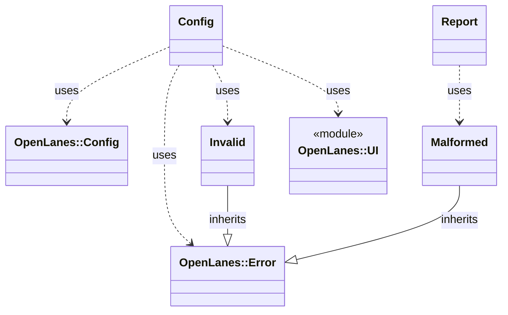

<!-- Generated once by `openlanes uml` from main at a80651d, before the 4.0 refactor. Frozen: do not regenerate or edit. -->

# OpenLanes::Coverage

```mermaid
classDiagram
  class OpenLanes__Config["OpenLanes::Config"]
  class OpenLanes__Coverage__Config["Config"]
  class OpenLanes__Coverage__Invalid["Invalid"]
  class OpenLanes__Coverage__Malformed["Malformed"]
  class OpenLanes__Coverage__Report["Report"]
  class OpenLanes__Error["OpenLanes::Error"]
  class OpenLanes__UI["OpenLanes::UI"]
  <<module>> OpenLanes__UI
  OpenLanes__Coverage__Config ..> OpenLanes__Config : uses
  OpenLanes__Coverage__Config ..> OpenLanes__Coverage__Invalid : uses
  OpenLanes__Coverage__Config ..> OpenLanes__Error : uses
  OpenLanes__Coverage__Config ..> OpenLanes__UI : uses
  OpenLanes__Coverage__Invalid --|> OpenLanes__Error : inherits
  OpenLanes__Coverage__Malformed --|> OpenLanes__Error : inherits
  OpenLanes__Coverage__Report ..> OpenLanes__Coverage__Malformed : uses
```
